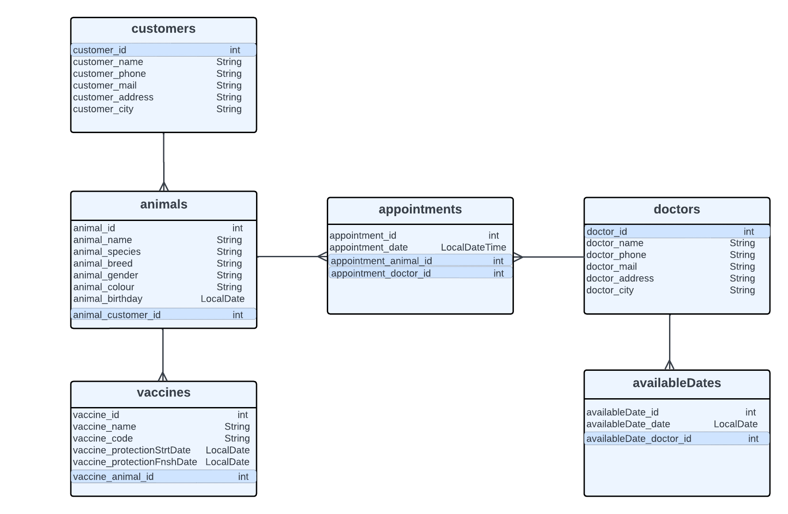
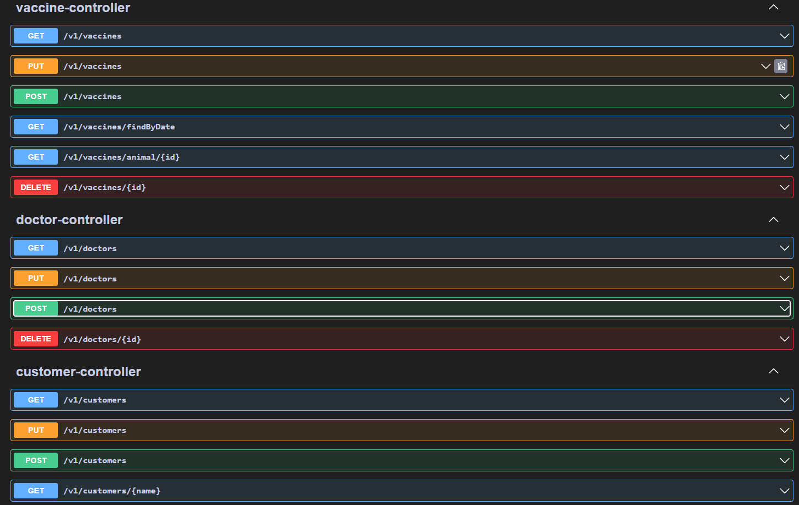
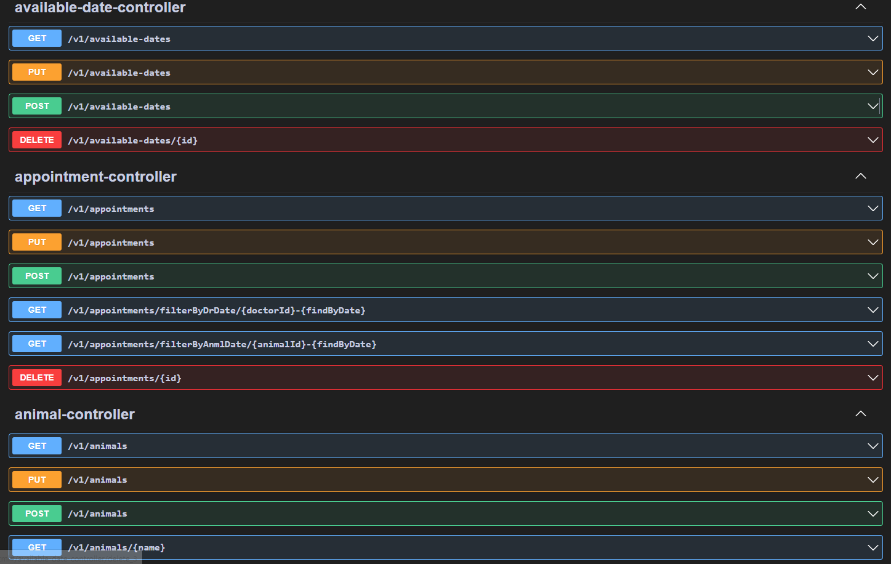
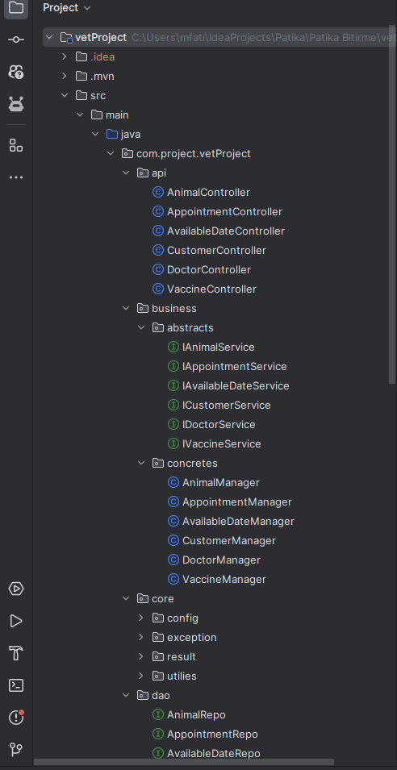
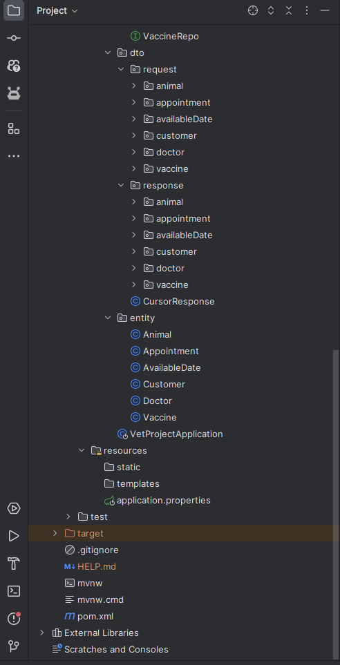

# Veteriner Yönetim Sistemi

Bu proje, bir veteriner kliniğinin işlerini yönetebilmek amacıyla geliştirilmiş bir API'yi içermektedir. Patika+ Full Stack Developer eğitiminin bitirme projesidir.

### Kullanılan Teknolojiler

- Spring Boot
- Spring Data JPA
- RESTAPI
- PostgreSQL
- Spring Web

## Proje Görüntüleri

Proje içerisinden bazı ekran görüntüleri aşağıdadır.

#### UML Diagram :

#### RestApi Swagger

#### Layer Architecture

